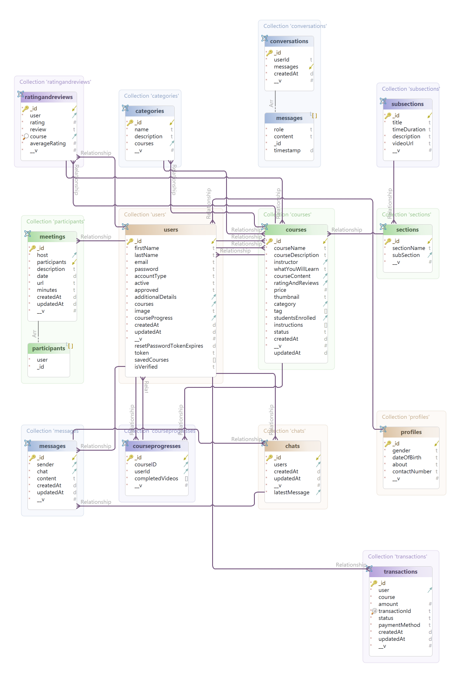

# Graduation Project Backend

Backend for an online learning platform built with Node.js, Express, and MongoDB (MongoDB Atlas). Supports user roles (Mentors & Students), course management, progress tracking, and real-time features including chat (with AI), meetings, and payments.

🧠 Integrated with OpenAI for AI chat and an external AI API that explains GitHub repos.

📧 Includes email verification via user signup.

💳 Real payments powered by Paymob.

📹 Meetings auto-generated via Jitsi when mentors create them.

☁ Media stored on Cloudinary.

🚀 Live on Glitch. Postman collection availabl

## Entity-Relationship Diagram (ERD)

Below is the ER diagram representing the database structure of this project:



## Features

- **User Authentication**: Secure login and registration using JWT tokens.
- **Data Management**: CRUD operations for managing project-related data.
- **Email Notifications**: Automated email sending using predefined templates.

## Technologies Used

- **Node.js**: JavaScript runtime environment.
- **Express.js**: Web framework for Node.js.
- **MongoDB**: NoSQL database for data storage.
- **Mongoose**: Object Data Modeling (ODM) library for MongoDB and Node.js.
- **JWT**: JSON Web Tokens for secure authentication.
- **Nodemailer**: Module for sending emails from Node.js applications.

## Folder Structure

- **config/**: Configuration files for database connections and other settings.
- **controllers/**: Route handlers defining the application's business logic.
- **mail/templates/**: Email templates used for notifications.
- **middleware/**: Custom middleware functions for request processing.
- **models/**: Mongoose schemas and models representing data structures.
- **routes/**: API endpoints and route definitions.
- **utils/**: Utility functions and helpers.

## Getting Started

### Prerequisites

- Node.js installed on your machine.
- MongoDB instance running locally or accessible remotely.

### Installation

1. **Clone the repository**:

   ```bash
   git clone https://github.com/15mahmoud/graduation-project-backend.git

2. **Navigate to the project directory**:

   ```bash
   cd graduation-project-backend
  
3. **Install dependencies**:

    ```bash
   npm install
    
4. **Start the server**:
 
   ```bash
   npm run dev
